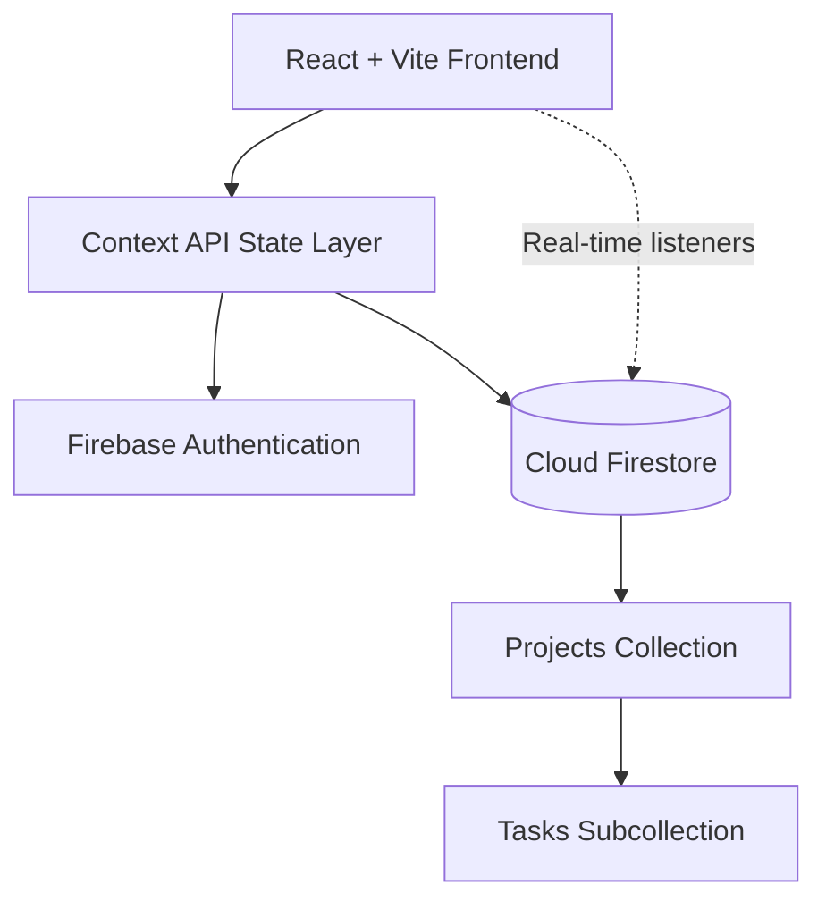

<div align="center">

# TaskForge

### Enterprise Project Management System

A role-based workflow management platform for structured project tracking, task orchestration, and real-time collaboration across Admin, Manager, and User roles.

**[Live Demo](https://project-management-system-mu-seven.vercel.app/)**

</div>

---

## Table of Contents

- [Overview](#overview)
- [Key Features](#key-features)
- [System Architecture](#system-architecture)
- [Data Model](#data-model)
- [Engineering Highlights](#engineering-highlights)
- [Tech Stack](#tech-stack)
- [Project Structure](#project-structure)
- [Getting Started](#getting-started)
- [Documentation](#documentation)
- [Author](#author)

---

## Overview

TaskForge is a full-stack project management system built to streamline enterprise workflows. It separates responsibilities across three roles, provides a structured lifecycle for projects and tasks, and keeps every dashboard synchronized in real time.

Each role receives its own dashboard and permitted actions, so administrators, managers, and team members work from views that match their responsibilities.

---

## Key Features

### Role-Based Access Control

- Three roles: **Admin**, **Manager**, and **User**
- Secure, role-specific dashboard routing

### Project Lifecycle Management

- Project creation and management
- Manager assignment per project
- Defined status flow: **Active → In Review → Completed**

### Task Orchestration

- Task creation within projects
- Assignment to team members
- Priority-based classification
- Deadline tracking

### Collaboration Layer

- Threaded task comments
- Activity logging for all actions
- Real-time updates across users

### Real-Time Synchronization

- Firestore listeners for live data
- Instant updates propagated across dashboards

---

## System Architecture



The frontend manages application state through the Context API, authenticates users with Firebase Authentication, and reads and writes workflow data in Cloud Firestore, where real-time listeners keep every client current.

---

## Data Model

Workflow data is modeled hierarchically in Firestore: projects are top-level documents, and tasks live in subcollections beneath their parent project. This keeps task queries scoped to a project and supports efficient real-time listeners.

---

## Engineering Highlights

- **Role-based architecture:** access and routing decisions driven by user role.
- **Hierarchical Firestore modeling:** projects with task subcollections for scoped, efficient queries.
- **Real-time collaboration:** Firestore listeners deliver cross-user updates without manual refresh.
- **Event-driven workflow tracking:** actions recorded in an activity log for traceability.
- **Context API state orchestration:** centralized state shared across role-specific views.

---

## Tech Stack

| Layer | Technology |
| :--- | :--- |
| Frontend | React, Vite, React Router |
| Styling | Tailwind CSS, Lucide Icons |
| Authentication | Firebase Authentication |
| Database | Cloud Firestore |
| State Management | React Context API |
| Hosting | Vercel |

---

## Project Structure

```text
TaskForge/
├── public/
├── src/
├── index.html
├── vite.config.js
├── tailwind.config.js
├── vercel.json
├── TECHNICAL_DOCUMENTATION.md
└── README.md
```

---

## Getting Started

### Prerequisites

- Node.js 18+
- npm 9+
- A Firebase project with Authentication and Firestore enabled

### Installation

```bash
npm install
```

Add your Firebase project credentials through environment variables, then start the development server:

```bash
npm run dev
```

### Production Build

```bash
npm run build
```

---

## Documentation

Detailed design notes are available in [`TECHNICAL_DOCUMENTATION.md`](TECHNICAL_DOCUMENTATION.md).

---

## Author

**Chella Krishnan D**
[GitHub](https://github.com/iamkr07) · [LinkedIn](https://linkedin.com/in/chella-krishnan-d-a91172383)
